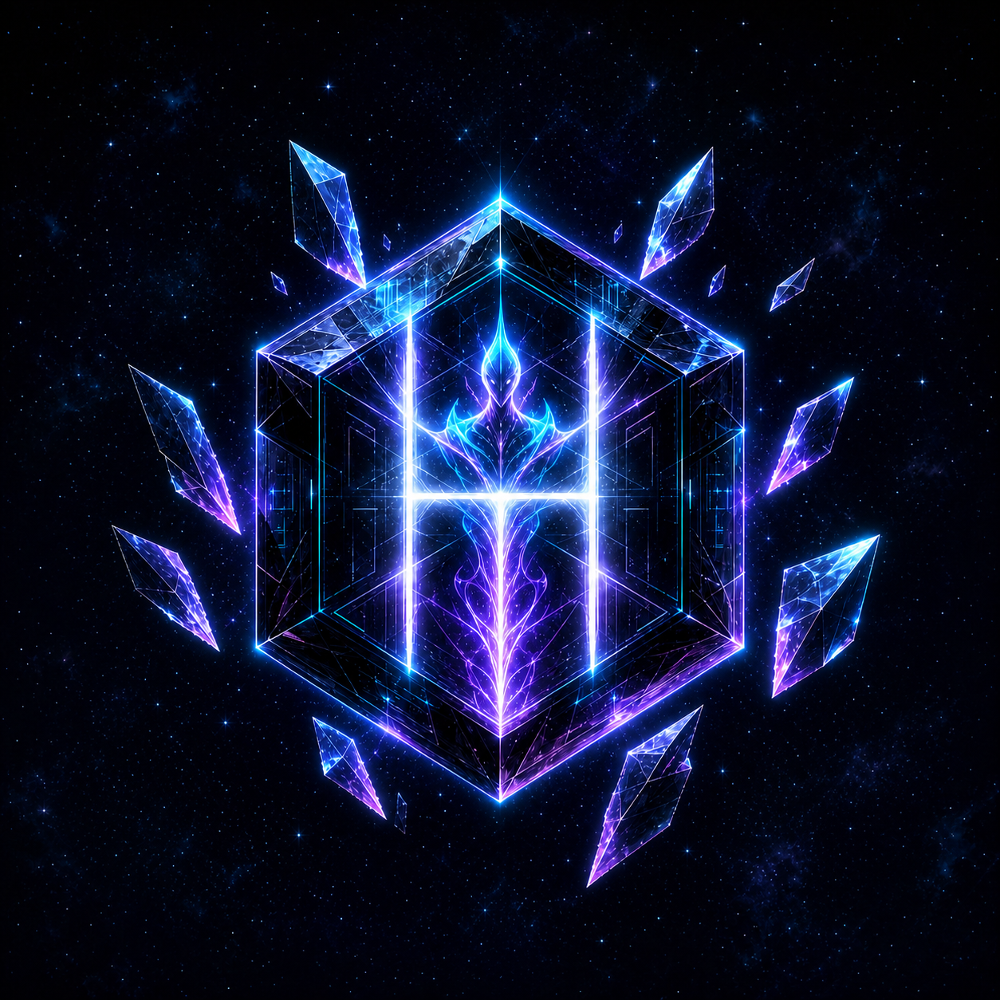
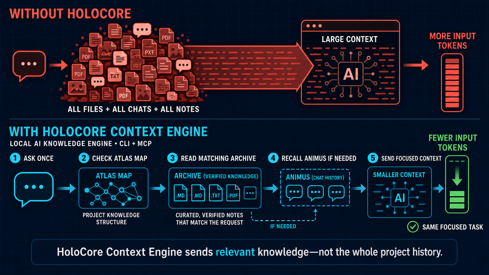
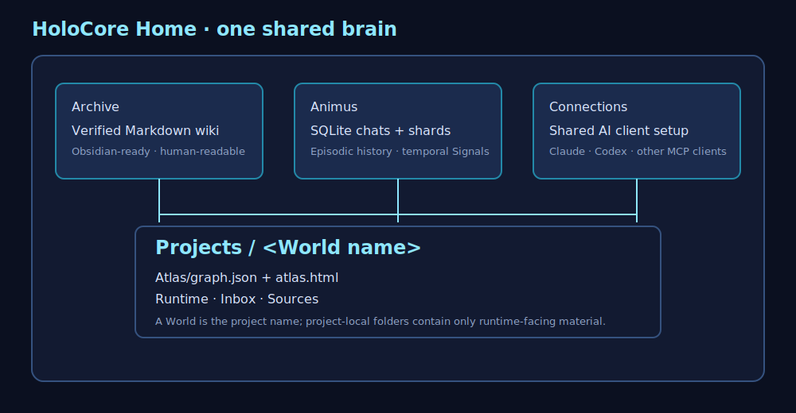
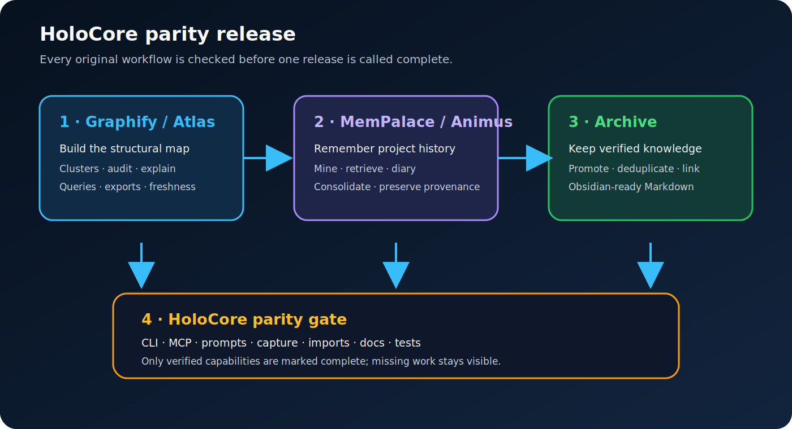

# HoloCore Context Engine



**HoloCore Context Engine** is a local AI knowledge system for all your projects. Version `0.6.0` combines one shared Markdown Archive with a project structural Atlas and shared episodic Animus behind one CLI, MCP server, and browser Console.





The runtime is HoloCore-native. It does not import, launch, or require the original Obsidian Second Brain, Graphify, or MemPalace applications. Those projects were behavioral references for the rewrite and are not runtime components.

## In simple terms

HoloCore gives an AI assistant three kinds of context:

- **Archive is the library:** verified notes, rules, and decisions.
- **Atlas is the map:** files, functions, dependencies, and relationships.
- **Animus is the memory:** previous work, conversations, errors, and useful events.

You choose one **HoloCore Home**. Its `Archive` folder is one Obsidian-ready vault shared by every registered project. Each project is a **World** with its own section in that vault and its own private generated runtime.

```text
<Home>/
├── Archive/                       One Obsidian vault
│   ├── Worlds/<world-id>/         Durable knowledge for one project
│   ├── Shared/                    Knowledge intentionally shared by projects
│   └── system/index.md            Vault entry point
└── worlds.json                    Registered World list

<Home>/
├── Animus/animus.db                Shared SQLite memory and chat history
├── Animus/raw-chats/<world>/        Immutable original chat audits
└── Projects/<world>/Atlas/         Per-World graph.json and atlas.html
```

Archive is shared as a vault, but retrieval remains scoped: HoloCore searches the active World's entries and `Shared`, not every other World.

## How retrieval works

HoloCore builds one route and executes it once:

`readiness check → Atlas → active World Archive + Shared → Animus when history matters → exact sources`

`holocore search` checks Atlas freshness and refreshes the local graph when required. Atlas narrows the project scope first. Archive adds verified knowledge. Animus runs last only for questions about earlier work, errors, attempts, or conversations. Every selected subsystem runs at most once, and a recursion guard prevents a HoloCore search from routing back into itself.

## Automatic memory

Setup installs local capture hooks for supported clients:

- Claude Code captures at `SessionEnd`.
- Codex captures at `Stop`.

The hook reads only new transcript content, stores a raw audit under the project, distills useful Memory Shards into local Animus, and automatically promotes useful facts, decisions, preferences, entities, and summaries into the active World's Archive. Promotion uses deterministic names and deduplication so the same extraction is not repeatedly added.

Hooks are installed automatically but require client trust once:

- In Claude Code, restart the project and use `/mcp` to approve or confirm the HoloCore server.
- In Codex, restart or reopen the project and use `/hooks` to review and trust the HoloCore Stop hook.

## Quick start

Install from Git:

```powershell
uv tool install "git+https://github.com/VenomD846/HoloCore.git"
```

Set up the first project and explicitly choose the shared Home:

```powershell
cd <project>
holocore setup --home <Home>
```

Later projects reuse the saved Home:

```powershell
cd <another-project>
holocore setup
```

On an interactive first run without `--home`, setup asks where the shared Home should live. `holocore home <Home>` selects or changes it explicitly.

After setup:

```powershell
holocore status
holocore paths
holocore worlds
holocore search "Why did we choose SQLite?"
holocore console                    # open the local browser Console
```

The Console brings chats, Memory Shards, Decks and Signal Chronicles, the
World wiki, exact storage locations, command invocations, and the Atlas link
into one local view. Wiki edits are validated through the Archive API; captured
chats remain immutable.

Use the World selector in the Console header to move between registered
projects without restarting the server. The Commands tab is grouped by
purpose; the other tabs are scoped to the selected World.

Console panels and triggers:

- **Chat Deck** — captured provider transcripts, dates, sources, and searchable text; populated by `UserPromptSubmit`, `Stop`, or `SessionEnd` hooks.
- **Animus** — Memory Shards, Decks, Signal Chronicles, provenance, and episodic history; read by HoloCore retrieval and MCP.
- **Archive** — editable AI-first Markdown wiki with managed/user-owned provenance and source links.
- **Atlas** — Signals, Constellations, relationships, paths, explanations, and community clusters; refreshed by ingest or `atlas-refresh`.
  The Console also embeds a Solar System Atlas: one galaxy-level World node per registered project with that World's Signals and relationships beneath it.
- **Locations** — exact Home, World, Animus, Archive, Atlas, raw-chat, and connection paths.
- **AI Commands** — commands grouped by effect for Claude, Codex, and MCP clients.
- **Maintenance** — ingest, resync, cleanup preview, diagnostics, migration, and freshness status.

The vocabulary is consistent everywhere: a **Deck** is a bounded context inside
a World; a **Signal** is a tracked concept, person, system, or decision; a
**Chronicle** is the temporal history of a Signal; and a **Constellation** is a
connected Signal graph.

Open `<Home>/Archive` as one Obsidian vault if you want Obsidian's Markdown and graph interface. Obsidian is optional; HoloCore works from the CLI and AI clients without it.

## Keep every World current

```powershell
holocore sync-all
holocore update
```

`sync-all` reconciles generated integration files and refreshes Atlas for every registered World. `update` upgrades the installed CLI and then performs the same all-World reconciliation. For a large installation, update the CLI first and reconcile separately:

```powershell
holocore update --no-sync
holocore sync-all
```

The second command can take time because it reads each registered World's source files and rebuilds its Atlas. Press `Ctrl+C` to stop a refresh safely; the installed CLI remains updated. Close active Claude/Codex MCP sessions before updating if Windows reports that `holocore.exe` is in use. Missing project folders are reported without stopping other Worlds.

## AI clients

Setup creates non-destructive project integrations for Claude Code, Codex, Gemini, Cursor, and OpenCode:

- Claude receives `.mcp.json`, project slash commands and skills, plus a `SessionEnd` capture hook.
- Codex receives `.codex/config.toml`, `$`-invoked skills under `.agents/skills`, plus a `Stop` capture hook.
- Gemini, Cursor, and OpenCode receive their native project MCP and command formats.

Use `holocore connect` to add or repair integrations after installing another client. Existing unrelated settings are preserved; invalid files are skipped with a warning rather than overwritten.

## Canonical vocabulary

- **Archive** = verified knowledge.
- **Atlas** = structural map.
- **Animus** = remembered history.
- **World** = project.
- **Sector** = area inside a project.
- **Memory Shard** = raw remembered fragment.
- **Archive Entry** = polished durable note.
- **Signal** = one mapped thing.
- **Constellation** = group of related mapped things.
- **Deck** = bounded context inside a World for related memories.
- **Signal** = a named concept, person, system, or decision tracked over time.
- **Chronicle** = the time-ordered assertions and changes for a Signal.

## Documentation



The current release includes Atlas clustering, audits, explain/path analysis and exports; Animus mining, checkpoints, diary, consolidation and optional embedding retrieval; conflict-aware Archive promotion; native AI-client integration generation; and automated interface/parity checks. HoloCore's HTML Atlas is portable and AI-friendly. For the richest visual knowledge graph, open the shared `Archive` vault in Obsidian.

- [Visual guide](docs/visual-guide.md)
- [User guide](docs/user-guide.md)
- [Installation guide](docs/installation.md)
- [Prerequisites and optional graph tools](docs/prerequisites.md)
- [Workflow guide](docs/workflows.md)
- [Slash-command and skill reference](docs/slash-commands.md)
- [Configuration guide](docs/configuration.md)
- [MCP reference](docs/mcp-reference.md)
- [Architecture and technical guide](docs/architecture.md)
- [Troubleshooting](docs/troubleshooting.md)
- [Portability and AI-client guide](docs/portability-ai-clients.md)
- [Capability status](docs/capability-status.md)
- [Product identity and discovery tags](BRANDING.md)
- [Acknowledgments and third-party provenance](THIRD_PARTY_NOTICES.md)

## Safety model

HoloCore is local-first. Archive Markdown stays in the user-selected Home. Atlas, Animus, transcript cursors, and raw chats stay inside each project. Setup and reconciliation merge only HoloCore-owned integration entries. Capture hooks are non-blocking and should never prevent the parent AI client from ending a session.

Raw chats and Animus can contain sensitive information. HoloCore adds their paths to the project `.gitignore`; protect and back them up according to your own data policy.

## License and development

HoloCore is licensed under the [Apache License 2.0](LICENSE). Third-party behavioral inspirations and their licenses are recorded in [THIRD_PARTY_NOTICES.md](THIRD_PARTY_NOTICES.md).

Development verification:

```powershell
$env:PYTHONPATH = "src"
python -m pytest -q
uv build
```
