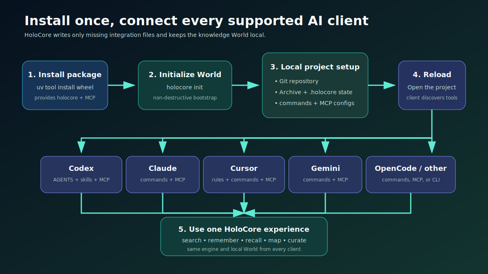

# Installation guide



HoloCore installs once as a command-line tool. Each project then gets its own visible Archive, generated runtime, and AI-client connections.

## 1. Install HoloCore

Install [`uv`](https://docs.astral.sh/uv/) if it is not already available, then install HoloCore:

```powershell
uv tool install "git+https://github.com/VenomD846/HoloCore.git"
```

After HoloCore is published on PyPI, the shorter equivalent will be:

```powershell
uv tool install holocore
```

The installation provides both `holocore` and the local `holocore-mcp` server. Python environments, editable installs, Obsidian, external memory tools, and LLM API keys are not part of normal onboarding.

## 2. Set up any project

Change into an existing or new project and run setup:

```powershell
cd C:\path\to\project
holocore setup
```

The current directory becomes the HoloCore World. Setup is non-destructive: it creates missing files and adds or merges HoloCore client configuration without replacing unrelated settings.

## What setup creates

```text
<project>/
├── Archive/
│   ├── Inbox/                 Temporary knowledge awaiting curation
│   ├── wiki/                  Verified, durable Archive Entries
│   └── system/
│       └── index.md           Starting index for the Archive
├── .holocore/
│   ├── atlas.json             Machine-readable structural Atlas
│   ├── atlas.html             Interactive Atlas for a web browser
│   ├── animus.db              SQLite store for episodic Memory Shards
│   └── raw-chats/             Original chat audits used for refinement
└── HOLOCORE-START-HERE.md      Short project-specific entry point
```

Setup also creates client-native command definitions and `$`-invoked Codex skills, then registers the HoloCore MCP server for Claude Code, Codex, Gemini, Cursor, and OpenCode. Existing configuration is preserved.

## 3. Reopen your AI client

Client configuration is discovered at startup. Restart the client or reopen the project after setup.

### Claude Code

- MCP configuration: `<project>/.mcp.json`
- Check the connection: `/mcp`
- Slash command: `/holocore-search`
- Generated MCP prompt: `/mcp__holocore__search`

Restart Claude after `holocore setup`, run `/mcp`, and confirm that `holocore` is connected before searching.

### Codex

- MCP configuration: `<project>/.codex/config.toml`
- Project skills: `<project>/.agents/skills`
- Search skill: `$holocore-search`

Restart Codex or reopen the project after setup so the MCP server and project skills are discovered.

Gemini receives project-local TOML command definitions under `<project>/.gemini/commands`. Cursor and OpenCode receive their native project command formats. Codex uses `$`-invoked skills under `.agents/skills`, not slash commands. Run `holocore connect` if a client was installed after the initial setup or if its connection needs to be repaired.

## Optional: open Archive in Obsidian

Obsidian is not required. Archive is ordinary Markdown and HoloCore works without the Obsidian application.

To browse it as an Obsidian vault:

1. In Obsidian, choose **Open folder as vault**.
2. Select `<project>/Archive`.

Use the separate `.holocore/atlas.html` file when you want HoloCore's structural code and file graph.

## Useful setup commands

| Command | Purpose |
|---|---|
| `holocore paths` | Show the active project and every HoloCore data/configuration path |
| `holocore connect` | Add or repair supported AI-client integrations non-destructively |
| `holocore doctor` | Check files, runtime state, commands, and client connections |
| `holocore open-archive` | Open the top-level Archive with the configured/default application |

Run these commands from the project directory. Advanced users can still select another World with `--root <path>`.

## Upgrade or uninstall

Upgrade a PyPI installation with `uv tool upgrade holocore`. For a Git installation, rerun `uv tool install --force "git+https://github.com/VenomD846/HoloCore.git"`. Uninstall with `uv tool uninstall holocore`.

Removing the tool does not delete project-owned `Archive`, `.holocore`, client integrations, or `HOLOCORE-START-HERE.md` files.
