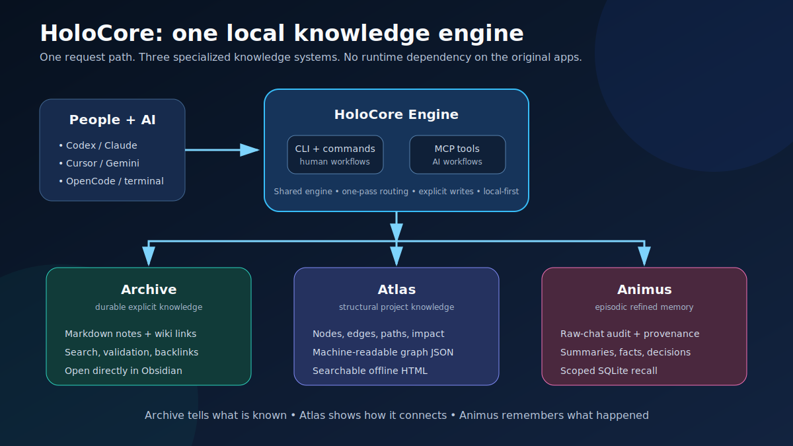

# HoloCore visual guide

This page explains HoloCore in everyday language. You do not need to understand Python, databases, MCP, or knowledge graphs.

## HoloCore in one sentence

HoloCore gives your AI assistant a **library for important knowledge**, a **map of your project**, and a **memory of previous work**—all through one local application.

## The whole system

Think of HoloCore as an office with three specialist rooms:

| Part | Simple comparison | What it keeps | When it helps |
|---|---|---|---|
| **Archive** | A carefully organised library | Verified notes, rules, decisions, instructions, and wiki links | “What is our agreed deployment process?” |
| **Atlas** | A live map or blueprint | Files, functions, symbols, dependencies, and relationships | “What uses this function, and what could this change affect?” |
| **Animus** | A project diary with useful highlights | Previous work, chats, errors, attempts, preferences, and events | “What happened the last time we fixed this problem?” |
| **HoloCore Engine** | The receptionist and coordinator | One consistent set of commands and AI tools | Decides which specialist rooms are useful for the question |

The command line and supported AI clients use the same HoloCore Engine. This means Codex, Claude, Cursor, Gemini, OpenCode, and terminal users can work with the same local knowledge instead of maintaining separate copies.

### What belongs where?

- Put a verified rule or long-term decision in **Archive**.
- Let **Atlas** describe structure that can be rebuilt from the project files.
- Put previous conversations, attempts, and work history in **Animus**.
- Keep exact source code and documents in the project itself; HoloCore retrieves them only when needed.

HoloCore does not copy everything into all three places. Each kind of information has one clear owner, which reduces duplication and confusion.

## How unified search works

### Step 1 — You ask one question

You use `holocore search`, a slash command, or an MCP tool. For example: “Why did we choose SQLite, and which files use it?”

### Step 2 — HoloCore checks before searching

HoloCore checks that its folders and configuration exist and checks whether Atlas is fresh. This is read-only. If Atlas is missing or stale, HoloCore reports that state rather than silently rebuilding it or trusting outdated structure.

### Step 3 — Atlas narrows the project scope first

When Atlas is fresh, HoloCore searches the graph once to identify relevant files, functions, classes, paths, and relationships. These graph results become search hints for the next stage.

### Step 4 — Archive checks the corresponding wiki knowledge

Archive is searched once using the original question plus the bounded Atlas hints. This finds durable rules and decisions associated with the identified project area instead of searching the wiki without context.

### Step 5 — Animus is consulted only when history matters

Words such as “previous,” “again,” “earlier,” “error,” or “last time” activate one scoped Animus lookup. Questions that do not need prior work skip this stage.

### Step 6 — Only exact sources are opened

HoloCore returns one source-labelled result set. The AI opens only the exact notes and project files identified by the checks, keeping the model context focused.

### Why the route cannot loop

The route is built once and moves in one direction. A context-local guard rejects any attempt for the same HoloCore search to call itself. Atlas, Archive, and Animus can each run at most once per request.

### Why this matters

Searching everything for every question would be slower, produce more noise, and waste AI context. Atlas first narrows the scope; Archive adds trusted knowledge; Animus adds history only when needed. The final context contains relevant evidence instead of the whole repository and chat history.

## How a chat becomes useful memory

### Step 1 — A chat is supplied

`holocore ingest-chat` receives an exported conversation. This can contain questions, answers, decisions, mistakes, and ordinary discussion.

### Step 2 — The original chat is preserved

HoloCore stores a separate raw audit copy. This is the evidence: it can be checked or processed again later. Raw chats may be sensitive, so `.holocore/raw-chats` should be protected.

### Step 3 — One refinement pass removes the noise

HoloCore uses either:

- your configured OpenAI-compatible LLM, with your custom instructions; or
- the keyless local fallback when no remote model is configured.

The provider is called once to produce all memory categories. HoloCore does not make one call for the summary and additional calls for every fact or decision.

### Step 4 — The useful parts are separated

The refinement result contains:

- **Summary:** the short story of what the conversation was about.
- **Facts:** reusable information learned during the conversation.
- **Decisions:** choices that were actually made.
- **Preferences:** how the user prefers work to be done.
- **Entities:** important projects, people, tools, and systems mentioned.

### Step 5 — Animus stores small, traceable memories

Animus removes identical duplicates, records where each memory came from, and stores it in the correct World and Sector. Future AI sessions can recall the useful memory without loading the entire raw conversation.

### What does not happen automatically?

A chat memory does not automatically become a permanent Archive rule. Only verified, durable, reusable knowledge should be promoted into Archive. This prevents temporary guesses and failed debugging attempts from becoming official project guidance.

## How installation connects another AI client

### Step 1 — Install the package

Install the HoloCore wheel once on the computer. This provides the `holocore` command and the `holocore-mcp` server. The original Obsidian Second Brain, Graphify, and MemPalace applications are not required.

### Step 2 — Initialize a project

Run `holocore --root "C:\path\to\project" init`. The selected project becomes a HoloCore **World**. Initialization is non-destructive: existing AI-client files are skipped instead of overwritten.

### Step 3 — HoloCore prepares the local World

It creates the missing local state, Archive folders, Git repository, client instructions, commands or skills, and MCP configuration. The knowledge remains inside the project unless the user deliberately moves or shares it.

### Step 4 — Reload the AI client

Open or reload the project in Codex, Claude, Cursor, Gemini, or OpenCode. The client discovers its generated HoloCore instructions and commands. MCP-capable clients can start `holocore-mcp` and call HoloCore tools directly.

### Step 5 — Use the same experience everywhere

The user can search, remember, recall, map, and curate from any supported client. Every client reaches the same Archive, Atlas, Animus, and HoloCore Engine for that World.

## What happens during normal project work?

1. **Orient:** run `holocore status` to check that required folders exist and Atlas, Archive, and Animus are ready.
2. **Map first:** use a fresh Atlas to identify the relevant project area.
3. **Retrieve:** search corresponding Archive notes and only relevant Animus history before reading large parts of the project.
4. **Work:** inspect and change the exact files required for the task.
5. **Refresh structure:** run `atlas-refresh` after meaningful source changes so Atlas matches the project.
6. **Record history:** use `remember` or `ingest-chat` for useful project events and conversations.
7. **Curate carefully:** add only verified long-term knowledge to Archive and update an existing note before creating a duplicate.

This keeps three different questions separate:

- **What do we know and trust?** → Archive
- **How is the project connected?** → Atlas
- **What happened previously?** → Animus

## Example: fixing a repeated login problem

Suppose an AI assistant is asked: “The login error is back. What did we do before, and which code could be affected?”

1. HoloCore checks required folders and Atlas freshness without changing anything.
2. It searches **Atlas** first to identify authentication files, functions, and dependencies.
3. It searches the corresponding **Archive** notes for the official authentication design or constraints.
4. It checks **Animus** because “is back” and “before” indicate previous work is relevant.
5. HoloCore returns source-labelled results instead of sending the entire repository and every old chat to the AI.
6. The AI opens the exact source files identified by Atlas and verifies the implementation.
7. After the fix, Atlas can be refreshed and the verified outcome can be remembered. A genuinely durable new rule may then be added to Archive.

## Simple glossary

| HoloCore term | Plain meaning |
|---|---|
| **Archive** | Verified knowledge |
| **Atlas** | Structural map |
| **Animus** | Remembered history |
| **World** | Project |
| **Sector** | Area inside a project |
| **Memory Shard** | Raw remembered fragment |
| **Archive Entry** | Polished durable note |
| **Signal** | One mapped thing |
| **Constellation** | Group of related mapped things |
| **CLI** | Commands typed in a terminal |
| **MCP** | A standard way for an AI client to call HoloCore tools |

## Choose the right workflow

| What you need | What to use | What you receive |
|---|---|---|
| Save an agreed rule or durable decision | Archive | A readable Markdown note with links |
| Understand files or code relationships | Atlas | Search results, dependency paths, impact information, JSON, or HTML graph |
| Recall previous work or conversations | Animus | Small scoped memories with their original source |
| Ask a broad project question | Unified search | One combined, source-labelled result set |
| Connect an AI platform | Generated client integration or MCP | Access to the same local HoloCore World |
