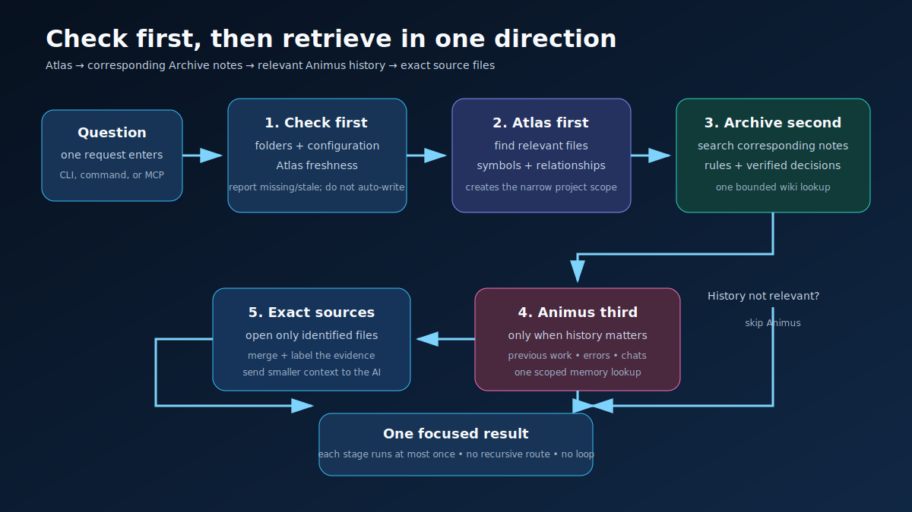
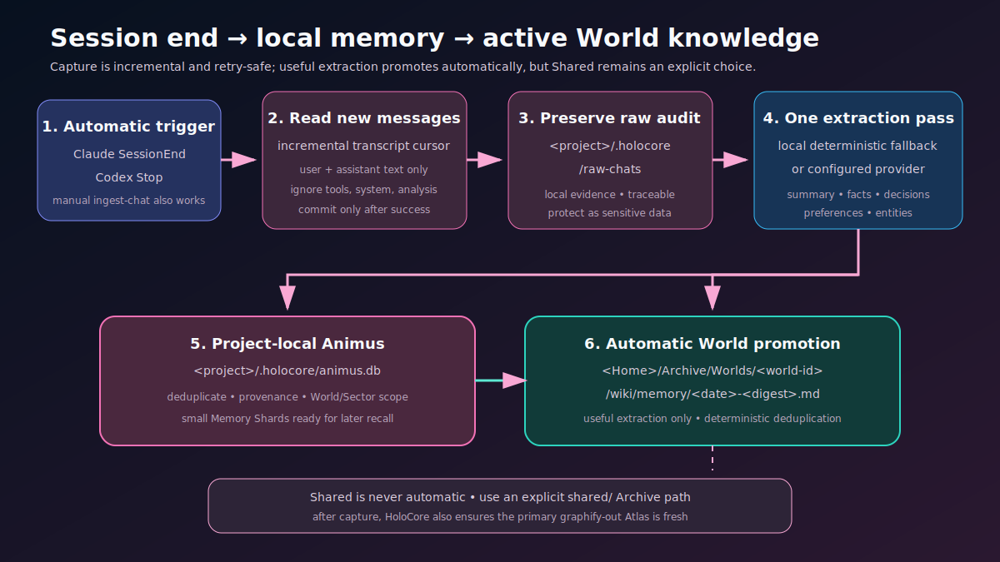

# Workflow guide

For a non-technical explanation, start with the [visual guide](visual-guide.md).

## Set up the shared brain

For the first World:

```powershell
cd <project>
holocore setup --home <Home>
```

For later Worlds:

```powershell
cd <another-project>
holocore setup
```

Open `<Home>/Archive` as one Obsidian vault. Durable notes for each World stay under `Worlds/<world-id>`; cross-project notes go under `Shared`.

After setup, restart the AI client:

- Claude Code: run `/mcp` and approve or confirm HoloCore.
- Codex: run `/hooks` and trust the HoloCore Stop hook.

## Orient before broad work

1. Run `holocore status`.
2. Use a fresh Atlas to identify relevant files, symbols, and relationships.
3. Search corresponding active-World and Shared Archive notes.
4. Query Animus only for earlier work, errors, attempts, or conversations.
5. Open exact source files last.
6. Make writes explicit and scoped.

```powershell
holocore atlas-search "Router dependency"
holocore archive-search "routing decision"
holocore recall "previous Router error" --sector project
```

The normal unified entry point performs the same sequence:

```powershell
holocore search "Why did the Router change, and what does it affect?"
```

It checks first, refreshes Atlas if stale, then runs Atlas → active World Archive + Shared → optional Animus once each. It never routes a HoloCore result back into HoloCore.



## Refresh structural knowledge

Refresh one World explicitly after meaningful source changes:

```powershell
holocore atlas-refresh
```

Generate and open its graph:

```powershell
holocore atlas-view
```

Unified search and all-World synchronization also ensure Atlas is fresh.

## Capture episodic knowledge automatically

Setup installs:

- Claude `SessionEnd` capture;
- Codex `Stop` capture.

At the event, HoloCore reads only new transcript content, writes a raw audit, refines memory, stores project-local Animus shards, promotes useful extraction into the active World Archive, and ensures Atlas freshness. The hook is non-blocking and commits its cursor only after successful ingestion.



## Capture or remember manually

Use `remember` for one explicit event:

```powershell
holocore remember "Decision: use one shared Archive vault" --sector project --source "design review"
```

Use `ingest-chat` for an exported message list:

```powershell
holocore ingest-chat <chat-export.json>
```

Use `mine` only when whole-file capture of a narrow, understood directory is intended.

## Curate durable knowledge

Create an active-World note:

```powershell
holocore archive-create "wiki/deployment.md" "Verified deployment process."
```

Create a Shared note explicitly:

```powershell
holocore archive-create "shared/wiki/naming.md" "Naming rule shared across Worlds."
```

Automatic memory promotion writes only to the active World's `wiki/memory`. It does not publish to Shared. Update an existing durable note before creating a duplicate whenever the knowledge belongs to the same concept.

## Reconcile all Worlds

After a client change or generated-file drift:

```powershell
holocore sync-all
```

HoloCore walks `<Home>/worlds.json`, reruns non-destructive bootstrap, and ensures Atlas freshness for each available project. Missing projects are reported and do not stop the rest.

## Update HoloCore and all Worlds

```powershell
holocore update
```

This reinstalls HoloCore from Git through `uv`, then runs the same all-World reconciliation. Use `sync-all` when you want reconciliation without reinstalling.

## Change Home

```powershell
holocore home <new-Home>
```

This selects and initializes another Home; it does not migrate the old one. Copy and verify data separately, then rerun setup in the Worlds that should use the new Home.

## Graph-view workflow

Archive and Atlas are different:

- Open `<Home>/Archive` in Obsidian to explore durable knowledge links.
- Run `holocore atlas-view` in a World to explore project structure.

Atlas HTML is self-contained and local. The MCP HTML tool refreshes the focused, Git-ignore-aware graph and returns `<project>/graphify-out/atlas.html` without forcing the AI client to open a browser. Search and filters reduce dense graphs; labels are collision-checked and expand on hover or selection.
